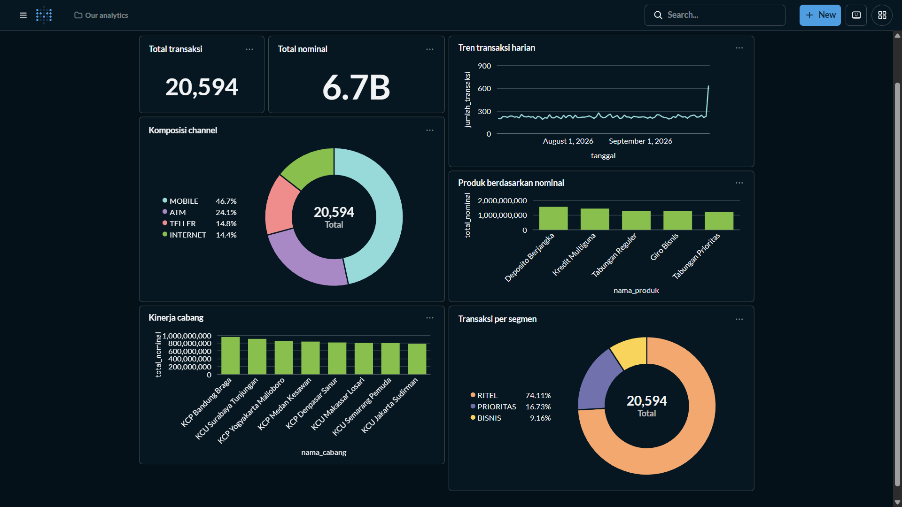
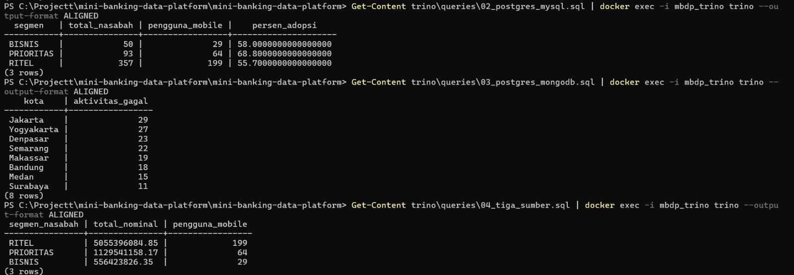
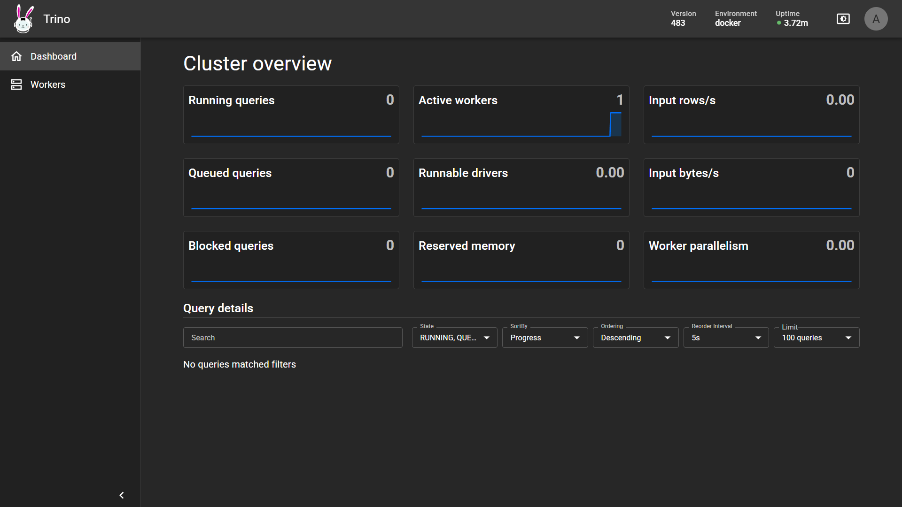
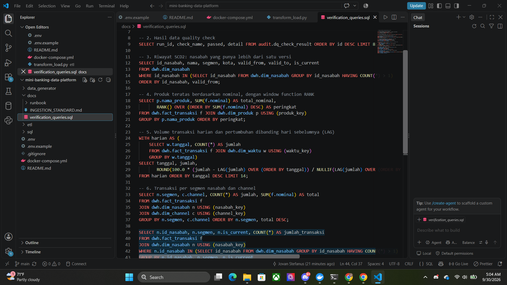

# Mini Banking Data Platform

Simulasi platform data ala perbankan: data dari beberapa sumber diproses lewat pipeline ETL ke **data warehouse (star schema)**, lengkap dengan **SCD Type 2**, **incremental load**, **audit log**, dan **data quality check**. Data warehouse dilayani lewat **REST API** (Java Spring Boot), **semantic layer + dashboard** (Metabase), dan **data virtualization** (Trino).

> **Semua data adalah data sintetis** (dibuat dengan Faker). Tidak ada data nasabah asli, dan NIK sudah dimasking.

Project portofolio untuk peran Data Engineer / Developer.

## Status

- [x] **Fase 1** – Source database (PostgreSQL, MySQL, MongoDB), skema DWH, generator data sintetis
- [x] **Fase 2** – Pipeline ETL ke DWH (SCD2, incremental load, audit log, data quality)
- [x] **Fase 3** – REST API Java Spring Boot (transaksi, master data nasabah, ringkasan harian)
- [x] **Fase 4a** – Semantic layer (view bisnis) dan dashboard Metabase
- [ ] **Fase 4b** – Data virtualization dengan Trino (query lintas PostgreSQL, MySQL, MongoDB)
- [ ] **Fase 5** – Muat MySQL/MongoDB ke DWH dan API master data, orkestrasi Airflow, unit test/Swagger/CI, Oracle/SQL Server, Kubernetes

## Arsitektur

```
 Source systems             ETL (Python)        Data Warehouse (PostgreSQL)            Serving
┌────────────────┐       ┌──────────────┐      ┌─────────────────────────────┐    ┌──────────────────┐
│ PostgreSQL     │       │ Extract      │      │ staging  (data mentah)      │    │ REST API         │
│ core banking   │──────►│ Transform    │─────►│ dwh      (star schema)      │───►│ Java Spring Boot │
├────────────────┤       │ & Load       │      │ semantic (view bisnis)      │───►│ Metabase         │
│ MySQL (channel)│  ...  │ Data quality │      │ audit    (monitoring ETL)   │    │ (dashboard)      │
│ MongoDB (log)  │       │ Audit log    │      └─────────────────────────────┘    └──────────────────┘
└───────▲────────┘       └──────────────┘
        │
        └── Trino (data virtualization): query lintas sumber tanpa memindahkan data
```

Saat ini pipeline ETL memuat data dari **PostgreSQL core banking**. MySQL dan MongoDB sudah terisi data sintetis dan dapat dibaca langsung lewat Trino; memuatnya ke DWH direncanakan pada Fase 5.

## Tech stack

| Area | Teknologi |
|---|---|
| Database | PostgreSQL 16, MySQL 8.4, MongoDB 7 |
| ETL | Python (psycopg2), SQL |
| REST API | Java 17, Spring Boot 4.1, JdbcTemplate, Maven |
| BI / dashboard | Metabase |
| Data virtualization | Trino |
| Infrastruktur | Docker, Docker Compose |
| Data sintetis | Faker |
| Version control | Git, GitHub |

## Model data

Star schema dengan `fact_transaksi` di tengah:

| Tabel | Jenis | Catatan |
|---|---|---|
| `fact_transaksi` | Fakta | Kunci `id_transaksi` dipakai untuk idempotensi |
| `dim_waktu` | Dimensi | 2020–2030, kunci `YYYYMMDD` |
| `dim_nasabah` | Dimensi | **SCD Type 2** (`valid_from`, `valid_to`, `is_current`) |
| `dim_produk` | Dimensi | SCD Type 1 |
| `dim_cabang` | Dimensi | SCD Type 1 |
| `dim_channel` | Dimensi | ATM, MOBILE, INTERNET, TELLER |

Tabel monitoring ada di schema `audit`: `etl_audit_log` dan `dq_check_result`.

## Fitur pipeline ETL

- **Incremental load**: transaksi diambil berdasarkan watermark `id_transaksi`, bukan seluruh tabel.
- **Idempotent**: pipeline aman dijalankan ulang (`ON CONFLICT DO NOTHING` + watermark) tanpa membuat data ganda.
- **SCD Type 2** pada `dim_nasabah`: perubahan nama, kota, atau segmen menutup versi lama dan membuat versi baru.
- **Point-in-time join**: transaksi dihubungkan ke versi nasabah yang berlaku saat transaksi terjadi.
- **Audit log**: setiap langkah mencatat status, jumlah baris dibaca/dimuat/ditolak, dan durasi.
- **Data quality check**: cek NULL, satu versi current per nasabah, nominal > 0, dan rekonsiliasi jumlah baris serta total nominal terhadap sumber.
- **Koneksi sumber read-only**: ETL tidak bisa mengubah data core banking.

Konvensi lengkap ada di [`docs/INGESTION_STANDARD.md`](docs/INGESTION_STANDARD.md).

## Semantic layer dan dashboard

Schema `semantic` berisi view bisnis di atas star schema. Definisi metrik ditulis **sekali** di view, sehingga semua laporan memakai angka yang sama dan analis tidak perlu memahami join star schema.

| View | Isi |
|---|---|
| `v_transaksi` | Tabel lebar (fakta + dimensi) dengan nama kolom yang mudah dipahami |
| `v_ringkasan_harian` | Jumlah, total, dan rata-rata nominal per hari |
| `v_kinerja_cabang` | Jumlah dan total nominal per cabang |
| `v_channel_mix` | Komposisi transaksi per channel (dengan persentase) |
| `v_produk_ranking` | Peringkat produk berdasarkan total nominal |
| `v_segmen_nasabah` | Jumlah nasabah, transaksi, dan nominal per segmen |

`segmen_nasabah` adalah segmen yang berlaku **saat transaksi terjadi** (hasil SCD Type 2).

Metabase memakai user `bi_reader` yang hanya boleh membaca schema `semantic`, tanpa akses ke `dwh`, `staging`, maupun `audit`.



### Menjalankan semantic layer dan Metabase

```powershell
# 1. Tambahkan BI_DB_PASSWORD di .env, lalu buat semantic layer dan user bi_reader (sekali saja)
Get-Content sql\ops\create_semantic_layer.sql | docker exec -i mbdp_pg_dwh psql -U dwh_user -d dwh -v bi_pw=PASSWORD_BI

# 2. Jalankan Metabase, lalu buka http://localhost:3000
docker compose up -d
```

Saat menambahkan database di Metabase: Host `postgres_dwh`, Port `5432`, Database `dwh`, Username `bi_reader`, Schemas → *Only these...* → `semantic`.

## Data virtualization (Trino)

Trino menjalankan **satu query SQL yang menggabungkan beberapa sumber tanpa memindahkan data**. Empat catalog dikonfigurasi di folder `trino/catalog/`:

| Catalog | Sumber |
|---|---|
| `core` | PostgreSQL core banking |
| `mysql` | MySQL channel banking |
| `mongodb` | MongoDB log aktivitas |
| `dwh` | Data warehouse (hanya schema `semantic`, lewat `bi_reader`) |

Contoh query lintas sumber ada di [`trino/queries/`](trino/queries/):

| File | Menggabungkan |
|---|---|
| `02_postgres_mysql.sql` | PostgreSQL + MySQL: adopsi mobile banking per segmen nasabah |
| `03_postgres_mongodb.sql` | PostgreSQL + MongoDB: aktivitas gagal per kota nasabah |
| `04_tiga_sumber.sql` | DWH + PostgreSQL + MySQL dalam satu query |

```powershell
docker compose up -d
Get-Content trino\queries\04_tiga_sumber.sql | docker exec -i mbdp_trino trino --output-format ALIGNED
```

Antarmuka web Trino ada di `http://localhost:8085` (username bebas, tanpa password).

<!-- Hapus tanda komentar ini setelah screenshot ditambahkan di docs/images:


-->

## REST API

API membaca data dari DWH memakai user database `api_reader` yang hanya punya hak `SELECT` di schema `dwh`.

| Endpoint | Fungsi |
|---|---|
| `GET /api/v1/transaksi?tanggal=&channel=&page=&size=` | Transaksi per tanggal, dengan paginasi (maks 200 per halaman) |
| `GET /api/v1/nasabah/{id}` | Master data nasabah (versi current) |
| `GET /api/v1/nasabah/{id}/riwayat` | Riwayat versi nasabah (SCD Type 2) |
| `GET /api/v1/ringkasan/harian?dari=&sampai=` | Jumlah dan total nominal transaksi per hari |
| `GET /actuator/health` | Status aplikasi |

Format tanggal `YYYY-MM-DD`. Nilai `channel`: `ATM`, `MOBILE`, `INTERNET`, `TELLER`. Input tidak valid menghasilkan `400` dengan pesan jelas, dan id yang tidak ada menghasilkan `404`.

### Menjalankan API

Prasyarat: JDK 17, dan database sudah berjalan dengan data hasil ETL.

```powershell
# 1. Tambahkan API_DB_PASSWORD di .env, lalu buat user read-only (sekali saja)
Get-Content sql\ops\create_api_reader.sql | docker exec -i mbdp_pg_dwh psql -U dwh_user -d dwh -v api_pw=PASSWORD_API

# 2. Muat .env ke terminal, lalu jalankan API
Get-Content .\.env | ForEach-Object { if ($_ -match '^\s*([^#=]+)=(.*)$') { [Environment]::SetEnvironmentVariable($matches[1].Trim(), $matches[2].Trim(), 'Process') } }
cd api
.\mvnw.cmd spring-boot:run
```

Contoh: buka `http://localhost:8080/api/v1/ringkasan/harian` untuk melihat tanggal yang punya data, lalu `http://localhost:8080/api/v1/transaksi?tanggal=YYYY-MM-DD&size=5`.

## Cara menjalankan ETL

### Prasyarat
- Docker Desktop (mesin berstatus *running*)
- Python 3.12 atau lebih baru (teruji di 3.14)
- Git

### Langkah (PowerShell, Windows)

```powershell
# 1. Siapkan konfigurasi. Ganti semua password di .env
copy .env.example .env

# 2. Jalankan database
docker compose up -d
docker compose ps

# 3. Siapkan Python
python -m venv .venv
.venv\Scripts\Activate.ps1
pip install -r data_generator/requirements.txt

# 4. Muat .env ke terminal (ulangi setiap membuka terminal baru)
Get-Content .\.env | ForEach-Object { if ($_ -match '^\s*([^#=]+)=(.*)$') { [Environment]::SetEnvironmentVariable($matches[1].Trim(), $matches[2].Trim(), 'Process') } }

# 5. Isi data sintetis ke database sumber
python data_generator/generate.py --nasabah 500 --transaksi 20000 --logs 5000

# 6. Jalankan pipeline ETL
python -m etl.run_pipeline
```

Untuk Linux/macOS, ganti langkah 4 dengan `set -a; source .env; set +a`.

> Metabase dan Trino masing-masing butuh sekitar 1–2 GB RAM. Di laptop dengan RAM 8 GB, jalankan salah satunya saja (`docker compose stop metabase` atau `docker compose stop trino`).

### Port

| Service | Port di laptop |
|---|---|
| PostgreSQL core banking | 15432 |
| PostgreSQL DWH | 5433 |
| MySQL channel | 3307 |
| MongoDB | 27017 |
| REST API | 8080 |
| Metabase | 3000 |
| Trino | 8085 |

Port database sengaja tidak memakai nilai default agar tidak bentrok dengan database lokal. Kalau kamu mengubah port, ubah di `docker-compose.yml` **dan** `.env`.

## Pengujian ETL

```powershell
python -m etl.run_pipeline        # load awal
python -m etl.run_pipeline        # run ulang: tidak ada baris baru (idempotent)
python -m etl.simulate_changes    # ubah segmen nasabah + tambah transaksi di sumber
python -m etl.run_pipeline        # SCD2 membuat versi baru, transaksi baru masuk
```

Hasil pengujian:

| Skenario | Hasil |
|---|---|
| Load awal | 20.000 transaksi dimuat, semua data quality check lulus |
| Run ulang | 0 baris baru, 0 versi SCD2 baru |
| Setelah simulasi | 10 versi SCD2 ditutup dan dibuat baru, 594 transaksi baru masuk, rekonsiliasi sumber = fact (20.594 baris) |

Kumpulan query untuk memverifikasi hasil (riwayat SCD2, audit log, window function `RANK` dan `LAG`) ada di [`docs/verification_queries.sql`](docs/verification_queries.sql).




## Struktur repository

```
.
├── docker-compose.yml
├── docker-compose.bi.yml       # Metabase
├── docker-compose.trino.yml    # Trino
├── .env.example
├── data_generator/             # generator data sintetis
├── etl/                        # pipeline ETL
│   ├── extract.py
│   ├── transform_load.py
│   ├── data_quality.py
│   ├── audit.py
│   ├── run_pipeline.py
│   ├── simulate_changes.py
│   └── sql/staging.sql
├── api/                        # REST API (Spring Boot)
│   └── src/main/java/dev/minibank/api/
│       ├── controller/
│       ├── repository/
│       ├── model/
│       └── error/
├── trino/                      # konfigurasi data virtualization
│   ├── catalog/                #   koneksi ke tiap sumber
│   ├── queries/                #   contoh query lintas sumber
│   └── access-control.properties
├── sql/                        # skema database
│   ├── source_postgres/        #   (dijalankan otomatis saat container pertama kali dibuat)
│   ├── source_mysql/
│   ├── dwh/
│   └── ops/                    #   skrip manual: user read-only API, semantic layer
└── docs/
    ├── INGESTION_STANDARD.md
    ├── verification_queries.sql
    └── images/
```

## Keputusan desain

- **Star schema** dipilih agar query analitik sederhana dan cepat (sedikit join, dimensi mudah dipahami pengguna bisnis).
- **SCD Type 2 untuk nasabah** agar analisis historis tetap akurat: transaksi lama tetap terhubung ke segmen nasabah saat itu, bukan segmen terbaru.
- **Staging schema** memisahkan proses extract dari transformasi, sehingga transformasi bisa dijalankan ulang tanpa membaca sumber lagi.
- **Audit log memakai koneksi terpisah** (autocommit) supaya catatan `FAILED` tetap tersimpan walaupun transaksi ETL di-rollback.
- **Python murni sebelum Airflow**: logika ETL dibuat dan dipahami dulu, baru dibungkus orkestrator.
- **API memakai user database read-only** (least privilege): kalau API bermasalah, data DWH tetap tidak bisa diubah. Pool koneksi juga diset read-only, dan API tidak punya akses ke schema `staging` maupun `audit`.
- **`JdbcTemplate` dipilih, bukan JPA**, karena query berupa join star schema yang bersifat analitik dan hanya-baca, sehingga SQL langsung lebih jelas dan mudah dioptimasi.
- **Semantic layer berupa view**: metrik didefinisikan sekali dan dipakai semua laporan; BI tool hanya melihat view, bukan tabel mentah.
- **ETL dan data virtualization dipakai bersama**: ETL untuk data yang sering dianalisis (performa stabil, tanpa membebani sumber), Trino untuk analisis cepat lintas sistem tanpa menyalin data.

## Keterbatasan yang diketahui

- Watermark berbasis `id_transaksi` tidak menangkap perubahan pada transaksi lama atau data yang datang terlambat.
- Kolom `loaded` pada dimensi SCD Type 1 menghitung baris yang di-upsert, bukan yang benar-benar berubah.
- Orkestrasi ETL masih manual (belum ada penjadwalan otomatis).
- MySQL dan MongoDB belum dimuat ke DWH (hanya bisa dibaca lewat Trino).
- API belum punya autentikasi/otorisasi, unit test, caching, dan dokumentasi OpenAPI/Swagger.
- Dashboard dibuat manual di Metabase dan belum disimpan sebagai kode; Metabase memakai database internal H2 (cukup untuk demo, bukan produksi).
- Trino dikunci read-only di level sistem, tetapi catalog `core`, `mysql`, dan `mongodb` masih memakai akun pemilik database. Untuk produksi, gunakan user read-only per sumber.
- Query Trino membebani sistem sumber dan tidak cocok untuk query berat yang berulang.
- Metabase dan Trino cukup berat di laptop dengan RAM terbatas.
- Data sintetis dibuat acak, sehingga distribusinya tidak mencerminkan pola nyata.

## Keamanan

- Hanya data sintetis, tidak ada data pribadi asli.
- NIK disimpan dalam bentuk masking.
- Kredensial dibaca dari `.env` dan tidak masuk Git (`.env` ada di `.gitignore`); konfigurasi Trino membaca password lewat `${ENV:...}`.
- Koneksi ETL ke sumber bersifat read-only.
- API memakai user `api_reader` dan BI tool memakai user `bi_reader`, masing-masing dengan hak `SELECT` yang dibatasi; semua nilai query API lewat placeholder (bukan digabung ke string SQL), dan pesan error tidak membocorkan detail internal.
